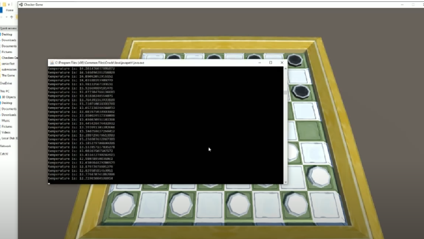

# Simulated Annealing Approach in Game Playing

[](https://youtu.be/zzoZIuM5ZaI?si=lbLC617alW9BgNNq)

## Overview

This research project implements and demonstrates the application of the **Simulated Annealing (SA)** algorithm in strategic game playing, specifically within the context of checkers. The project showcases how metaheuristic optimization techniques can be effectively applied to decision tree search problems in adversarial games.

## Research Context

Simulated Annealing is a probabilistic optimization algorithm inspired by the annealing process in metallurgy. In game playing, SA can explore complex decision spaces more efficiently than traditional exhaustive search methods, particularly when dealing with:

- Large decision trees with multiple branching factors
- Time-constrained environments requiring fast decision making
- Non-deterministic game states requiring adaptive strategies

## Project Components

### Core AI Engine (Java)
- **Simulated Annealing Implementation**: Probabilistic optimization algorithm for move selection
- **Minimax Algorithm**: Traditional game tree search for performance comparison
- **Decision Tree Framework**: Modular architecture supporting multiple AI strategies
- **Game State Management**: Complete checkers game logic with piece movement validation

### Graphical User Interface (Unity/C#)
- **3D Checkers Game**: Immersive visual representation of the game board
- **Real-time AI Integration**: Seamless communication between Java AI engine and Unity interface
- **Cross-platform Compatibility**: Windows executable with modern graphics requirements

## Technical Architecture

```
┌─────────────────┐    ┌─────────────────┐    ┌─────────────────┐
│   Unity Game    │◄──►│   File I/O      │◄──►│   Java AI       │
│   (C#)          │    │   Communication │    │   Engine        │
└─────────────────┘    └─────────────────┘    └─────────────────┘
         │                       │                       │
         ▼                       ▼                       ▼
   3D Visualization      Move Serialization     Algorithm Execution
```

## Key Features

### Algorithmic Capabilities
- **Adaptive Temperature Scheduling**: Dynamic cooling strategies for optimal exploration
- **Acceptance Probability Functions**: Configurable probability distributions for move acceptance
- **Depth-Limited Search**: Configurable search depth with time constraints
- **Performance Benchmarking**: Comparative analysis between SA and Minimax approaches

### Game Implementation
- **Complete Checkers Rules**: Standard checkers gameplay with piece promotion
- **Move Validation**: Comprehensive legal move checking and enforcement
- **Multi-turn Gameplay**: Support for continuous game sessions with state persistence
- **Win Condition Detection**: Automatic victory determination and game termination

## System Requirements

### Minimum Hardware
- **Processor**: 1 GHz or higher
- **Memory**: 4 GB RAM
- **Graphics**: DirectX 11 compatible
- **Storage**: 500 MB available space

### Software Dependencies
- **Java Runtime Environment**: Version 11 or higher
- **Operating System**: 64-bit Windows
- **Graphics Drivers**: Up-to-date DirectX compatible drivers

## Installation & Execution

1. **Prerequisites**: Ensure Java 11+ is installed and configured
2. **Game Launch**: Execute `finalGame.exe` from the `The Game/` directory
3. **AI Configuration**: Modify `aitype.txt` to select between "simulatedannealing" or "minimax"
4. **Gameplay**: Follow on-screen instructions for interactive play

**Note**: Do not modify text files during gameplay as they contain critical game state information.

## Research Methodology

The implementation evaluates Simulated Annealing's effectiveness through:

- **Empirical Performance Analysis**: Comparative studies against Minimax algorithm
- **Convergence Behavior**: Analysis of solution quality over time
- **Computational Efficiency**: Time complexity analysis for different game states
- **Scalability Assessment**: Performance evaluation across varying search depths

## Project Structure

```
Simulated-Annealing-Approach-in-Gameplaying/
├── Source Code/
│   ├── Checkers Game Ai/          # Java AI implementation
│   │   ├── src/                   # Core algorithm classes
│   │   └── out/                   # Compiled Java classes
│   └── Checkers Game Unity/       # Unity project files
├── The Game/                      # Executable game build
│   ├── finalGame.exe             # Main executable
│   └── finalGame_Data/           # Unity runtime assets
├── screen.png                     # Project screenshot
├── Instructions.txt              # Setup instructions
└── README.md                      # This file
```

## Technical Implementation Details

### Simulated Annealing Parameters
- **Initial Temperature**: 1,000,000 units
- **Cooling Schedule**: Exponential decay
- **Iteration Limit**: Configurable maximum evaluations
- **Acceptance Criteria**: Metropolis-Hastings algorithm

### Algorithm Flow
1. **State Evaluation**: Current game board assessment
2. **Neighbor Generation**: Legal move enumeration
3. **Cost Function**: Heuristic evaluation of board positions
4. **Acceptance Decision**: Probabilistic move acceptance
5. **Temperature Update**: Progressive cooling cycle

## Future Research Directions

- **Parameter Optimization**: Automated hyperparameter tuning
- **Alternative Cooling Schedules**: Comparative analysis of cooling strategies
- **Multi-objective Optimization**: Incorporating multiple evaluation criteria
- **Parallel Processing**: GPU acceleration for deeper search trees
- **Reinforcement Learning Integration**: Hybrid SA-RL approaches

## Contributing

This is a research-oriented project. For academic collaboration or technical discussions, please refer to the implementation details and consider the established research methodology.

## License

Research project - implementation details available for academic and educational purposes.

---

**Tech Stack**: Java, C# with Unity Engine